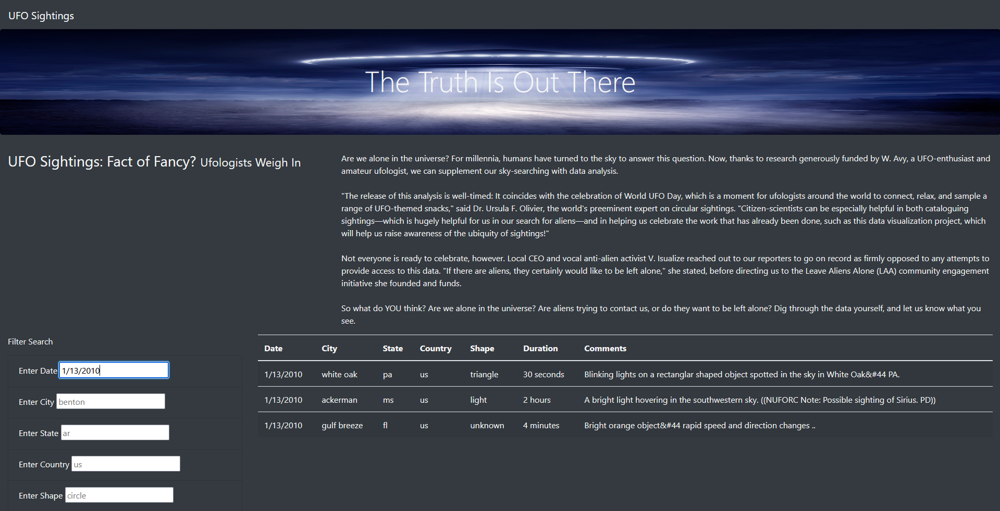
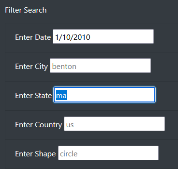
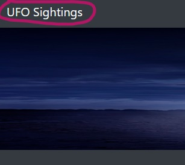

# UFOs

## Background
Dana’s webpage and dynamic table are working as intended, but she’d like to provide a more in-depth analysis of UFO sightings by allowing users to filter for multiple criteria at the same time. In addition to the date, you’ll add table filters for the city, state, country, and shape.

This assignment consists of one technical analysis deliverable and a written report.

## Deliverable 1: Filter UFO sightings on multiple criteria

The following filters have been added to the index.html file:

  - Enter Date
  - Enter City
  - Enter State
  - Enter Country
  - Enter Shape

## Deliverable 2

### Analysis 

There is a description of how to perform a search, with images. 

Search for UFO sightings is quite simple and flexible, we have multiple options to drill down the database according to our desired criteria.

  -  Searching is performed at the enter key.
  -  One or multiple options can be used to narrow down our search.

  -  To clear the fields please reload the page (or function key F5), or click the top banner "UFO Sightings"

## Summary:

While the webpage addresses its core functionality requirements there are certainly improvements that can be made to made it use cleared for the user and/or to maintain accurate and updated information.

Some recommendations as follows:

-	app.js relies on a fixed dataset that can be outdated if no methods are provisioned to automate the file source.
-	Adding visual information on how to search & specify criteria.
-	A “Clear Filter” page button next to the search options will make the life easier to the user.
-	A one liner with statics resulted from the search will also provide valuable information.
-	Definitely a map showing the results will be a great idea! Who’s got time to spare to code? 😊

